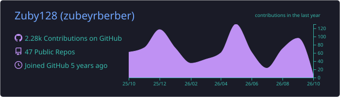
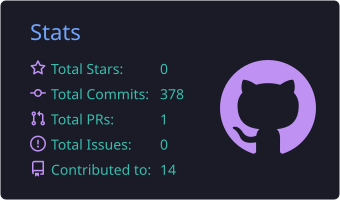
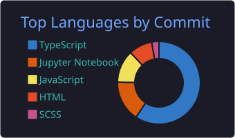
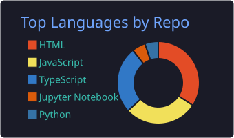
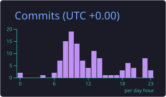

<!-- Header -->

  

  

  
  

---

## 👨‍💻 About Me

I'm a **Full Stack Developer** building SaaS & LMS platforms, e-commerce solutions and modern web apps, working mostly with **TypeScript**, **Node.js** on the backend and **React / Next.js** on the frontend.

- 🔭 Currently working at **Lorem Bilisim**
- 🌍 Worked with teams in **Norway, the Netherlands & Turkey**
- ⚙️ Building RESTful APIs with **NestJS & Express**, documented with **Swagger**
- 💳 Integrated payments: **Stripe, Iyzico, PayTr, Vipps**
- 📹 Real-time video, voice & messaging with **Agora & WebRTC**
- 🤖 Currently exploring **AI API integrations**
- 💬 Ask me about **Node.js, React, Next.js, SaaS architecture**
- 📫 Reach me at **zubeyrberber@gmail.com**

---

## 🛠️ Tech Stack

  <b>Languages & Frameworks</b>  
  

  <b>Databases, Cloud & DevOps</b>  
  

  <b>UI & Design</b>  
  

---

## 💼 Experience

| Period | Company | Role |
|:--|:--|:--|
| 2024 — Now | 🇹🇷 Lorem Bilisim | Full Stack Developer |
| 2024 | 🇳🇴 DAXAP | Full Stack Developer |
| 2023 — 2024 | 🇳🇱 Metrica Sports | Frontend Developer |
| 2022 — 2023 | 🇹🇷 Innovation & Partners | Full Stack Developer |
| 2020 — 2021 | 🇹🇷 XOX IT Company | Full Stack Developer |

---

## 📊 GitHub Stats

  

  
  

  
  

  

---

## 🐍 Contribution Snake

  <picture>
    <source media="(prefers-color-scheme: dark)" srcset="https://raw.githubusercontent.com/Zuby128/Zuby128/output/github-snake-dark.svg" />
    <source media="(prefers-color-scheme: light)" srcset="https://raw.githubusercontent.com/Zuby128/Zuby128/output/github-snake.svg" />
    
  </picture>

<!-- Footer -->

  

